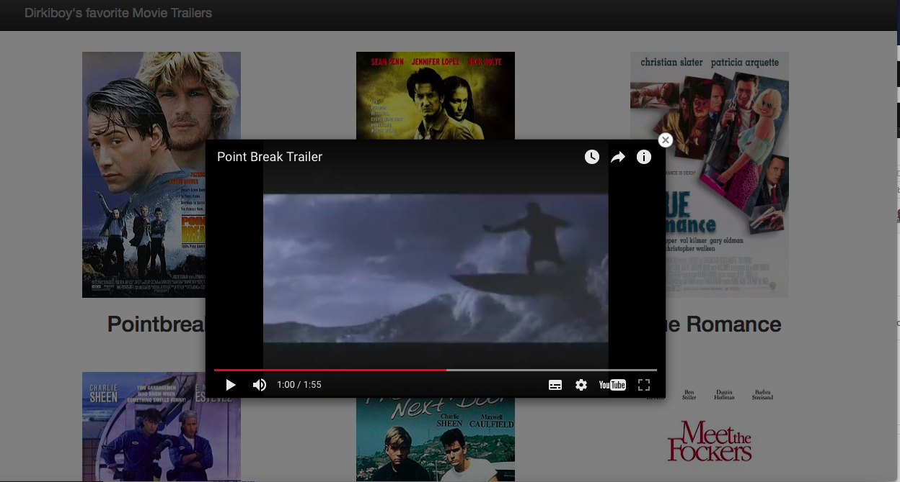

# Movie Trailor Project
This was my first project in the **Udacity Full Stack Web Developer Nanodegree**. It contains server-side code written in Python to store a list of my favorite movies, including box art imagery and a movie trailer URL. 
You can see the result [here](https://goo.gl/ojxhWK). 

## More Information
Python installed on your computer.

## How to run it?
Download the project, unzip the folder and run `entertainment_center.py` in your favorite Python Console. This creates 
`fresh_tomatoes.html` which openes in your favorite webbrowser:



## More Information

Once you downloaded and unzipped the project, you will find these files:


```
Movie-Trailor-Project-master/
├── site/
│   ├── entertainment_center.py
│   ├── fresh_tomatoes.py
│   ├── media.py
│   ├── entertainment_center.pyc (*)
│   ├── fresh_tomatoes.html (*)
│   └── media.pyc (*)
└── RADME.md
 ```


 _(*) = these files will be created after running `entertainment_center.py`_

- `entertainment_center.py` is the main file. It import the other two python files and creates instances of the class Movie. *You can change or add movies if you like. After saving and running this file, you will see the new website in your browser.* 

- `fresh_tomatoes.py` is the "heart" of the code. It generates the html-code with placeholders for the movie instances. All the html-style and scripting is stored in the two string variables `main_page_head` and `main_page_content`. Feel free to alter the code. The function `create_movie_tiles_content()` extracts the youtube ids from the url and puts all the code (movie information stored in instances of the class Movie and the HTML styling and scripting) together. `open_movies_page()` finally creates the html file `fresh_tomatoes.html` and opens it in the webbrowser.

- `media.py` simply creates the class Movie which acts as a blueprint for all movies on the website.


